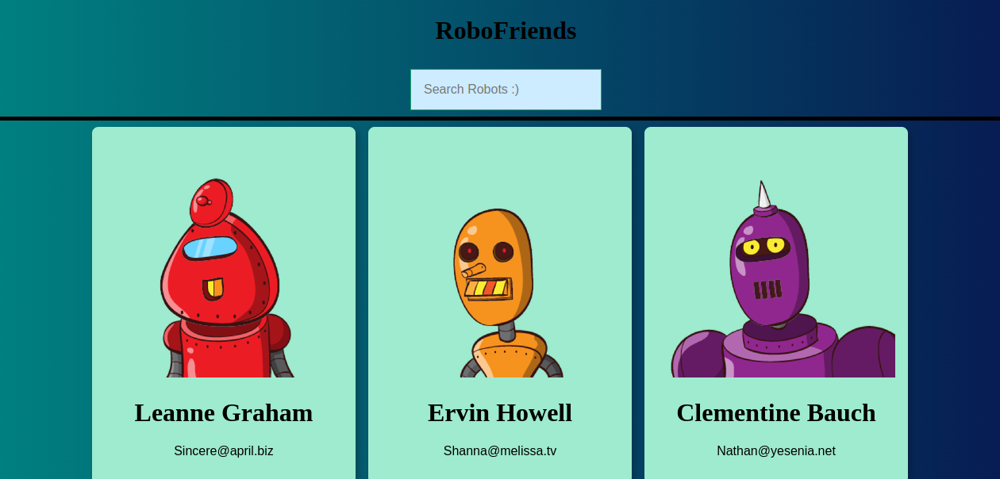

## Robo friends App
# Hello 👋

I build this App using the follow technologies:
1. ReactJs
2. JsonPlaceholder API

You can run the repo local by:
# 1. Cloning the repo
` git clone https://github.com/JamesSimel/robofriends.git`

# 2. Npm Install and NPM Start. To download the dependancies
` npm install`
` npm start`

Start coding the app to own liking!

**Happy coding 🚀!!**
**Please giving me a star or fork to make it available in your profile**
